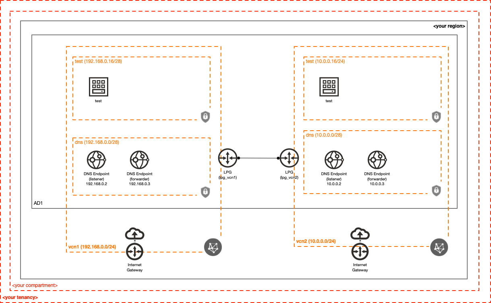
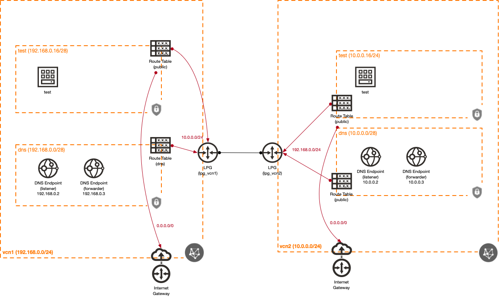
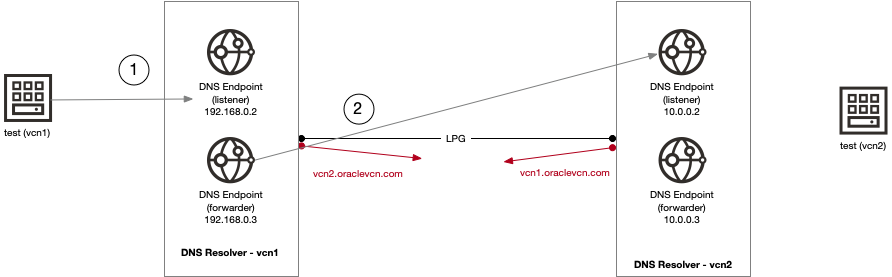

# Hybrid DNS solution in OCI

[](https://img.shields.io/badge/license-UPL-green) [](https://sonarcloud.io/dashboard?id=oracle-devrel_terraform-oci-hybrid-dns)

## Introduction
Most of the networked world relies on name resolution (ie. DNS).  When you're working with resources in OCI, accessing them via a friendly, easy-to-use DNS name shouldn't be any different.  Thanks to the awesome OCI DNS functionality, it doesn't need to be!  This is often called "hybrid DNS", as there are multiple DNS namespaces (usually private) that are interconnected.  This could be from an on-prem environment, another cloud (OCI and/or non-OCI) or any combination thereof.  Either way, combining the ability to query multiple private DNS namespaces from one spot can be super helpful.

This is a sample solution.  It's not meant to be a one-size-fits-all, but rather an example of how hybrid DNS can be configured in OCI.  This is an improvement over the solution I wrote several years ago, using dnsmasq (see the [artcle](https://www.ateam-oracle.com/post/hybrid-dns-in-oci) for a bit of history and context).  This particular revision uses native OCI functionality, meaning we don't need to build our own DNS infrastructure (and use fewer instances) but rely on the built-in OCI DNS functionality.

### Cloud Structure
Here's a high-level overview of the resources created with this solution:



### Logical Topology
Here's a high-level logical topology for this solution:



### How it works
This example does a few DNS-specific things:

* Associates the DNS View that's automatically created by each VCN with the DNS Resolver (that's also automatically created by the VCN).
* Sets up a DNS forwarding rule in the DNS Resolver for each VCN
* Creates two DNS endpoints for each DNS Resolver (in each VCN): one forwarder endpoint and one listener endpoint
* Creates a DHCP Options resource used by the `test` Subnet in each VCN, which tells the instances to send DNS queries to the local DNS listener Endpoint

When a DNS query comes in for the other VCN, here's what happens:

1. `test` instance sends the DNS query to the local DNS listener Endpoint.
2. The local DNS Resolver forwards the request to the other VCN listener Endpoint (this happens because we have a rule defined to do so).  This forwarded request is originated from the DNS forwarder Endpoint.  The other VCN responds, the response is sent back to the `test` instance.

Here's a visual representation of what's going on:



## Getting Started
At the time of this publishing, there is an outstanding [issue](https://github.com/terraform-providers/terraform-provider-oci/issues/1240) that requires a bit more involved process to setup/destroy the solution.  Make sure to follow the steps and you should be good-to-go!

### Deployment
Here's an overview of the process to deploy the sample:

1. Set variable values (typically using `terraform.tfvars`)
2. Run `terraform apply`
3. Modify `dns.tf`
4. Re-run `terraform apply`
5. Enjoy the sample!

Let's talk about these in a bit more detail.

#### Step 1 - Set variable values
There are several variables that are required.  If you're using Terraform CLI, one of the easiest ways to get going is to copy the `terraform.tfvars.template` file to `terraform.tfvars` and populate it with the values for your OCI environment.

#### Step 2 - Run `terraform apply`
It's time to deploy the resources using Terraform!  It's always a good idea to start with running `terraform plan` and review what Terraform proposes should be done.  Eventually you'll want to run `terraform apply` to actually deploy the resources.

#### Step 3 - Modify `dns.tf`
We need to attach the DNS View that's automatically created with the VCN, as well as setup a forwarding rule.  Modify the `dns.tf` file, uncommenting the part between the BEGIN/END comments:

```
resource "oci_dns_resolver" "vcn1" {
  ...
  
  ## BEGIN UNCOMMENT AFTER INITIAL DEPLOY
  # attached_views {                                                  <-- uncomment
  #   view_id = data.oci_dns_views.vcn1.views[0].id                   <-- uncomment
  # }                                                                 <-- uncomment
  # rules {                                                           <-- uncomment
  #   action = "FORWARD"                                              <-- uncomment
  #   destination_addresses = [ local.vcn2_dns_listener["ip"] ]       <-- uncomment
  #   source_endpoint_name = local.vcn1_dns_forwarder["name"]         <-- uncomment
  #   qname_cover_conditions = [ oci_core_vcn.vcn2.vcn_domain_name ]  <-- uncomment
  # }                                                                 <-- uncomment
  ## END UNCOMMENT AFTER INITIAL DEPLOY
  
  ...
}

...

resource "oci_dns_resolver" "vcn2" {
  ...
  
  ## BEGIN UNCOMMENT AFTER INITIAL DEPLOY
  # attached_views {                                                  <-- uncomment
  #   view_id = data.oci_dns_views.vcn2.views[0].id                   <-- uncomment
  # }                                                                 <-- uncomment
  # rules {                                                           <-- uncomment
  #   action = "FORWARD"                                              <-- uncomment
  #   destination_addresses = [ local.vcn1_dns_listener["ip"] ]       <-- uncomment
  #   source_endpoint_name = local.vcn2_dns_forwarder["name"]         <-- uncomment
  #   qname_cover_conditions = [ oci_core_vcn.vcn1.vcn_domain_name ]  <-- uncomment
  # }                                                                 <-- uncomment
  ## END UNCOMMENT AFTER INITIAL DEPLOY
  
  ...
}

...
```

This does two things:

* Attaches the existing private DNS view (created by/with the VCN) to the DNS Resolver.  Notice that the DNS Resolver itself was also created by/with the VCN.  We're referencing its ID in the `oci_dns_resolver` resource definition, by giving it the OCID of the existing DNS Resolver with the `resolver_id = data.oci_core_vcn_dns_resolver_association.vcn1.dns_resolver_id` line (similar is used for VCN2).
* Sets up a forwarding rule, to send requests for the other VCN DNS namespace, sourced from the local DNS forwarding Endpoint, destined to the other VCN's DNS listening Endpoint.

#### Step 4 - Run `terraform apply`
Because some changes were made to the `dns.tf` file, we'll need to re-run Terraform to apply these changes.

#### Step 5 - Enjoy!
The commands (useful for Linux/MacOS systems) to SSH into each of the two test instances is printed to the screen after running `terraform apply`.  To see it in action, SSH into the `test` instance in VCN1 and run `ping test.test.vcn2.oraclevcn.com`.  It'll resolve and you'll see pingage happiness!  The same can be done from the `test` instance in VCN2 (but resolving/pinging `test.test.vcn1.oraclevcn.com`).

### Destruction
Remember how provisioning this took a few extra steps?  Well, tearing it down is similar:

1. Comment out the `attached_views` and `rules` in each DNS Resolver resource (in `dns.tf`)
2. Run `terraform apply`
3. Run `terraform destroy`

#### Step 1 - Comments in `dns.tf`
You need to comment out (effectively removing) the `attached_views` and `rules` blocks in the `oci_dns_resolver` resources in the `dns.tf` file:

```
resource "oci_dns_resolver" "vcn1" {
  ...
  
  ## BEGIN UNCOMMENT AFTER INITIAL DEPLOY
  attached_views {                                                  <-- comment
    view_id = data.oci_dns_views.vcn1.views[0].id                   <-- comment
  }                                                                 <-- comment
  rules {                                                           <-- comment
    action = "FORWARD"                                              <-- comment
    destination_addresses = [ local.vcn2_dns_listener["ip"] ]       <-- comment
    source_endpoint_name = local.vcn1_dns_forwarder["name"]         <-- comment
    qname_cover_conditions = [ oci_core_vcn.vcn2.vcn_domain_name ]  <-- comment
  }                                                                 <-- comment
  ## END UNCOMMENT AFTER INITIAL DEPLOY
  
  ...
}

...

resource "oci_dns_resolver" "vcn2" {
  ...
  
  ## BEGIN UNCOMMENT AFTER INITIAL DEPLOY
  attached_views {                                                  <-- comment
    view_id = data.oci_dns_views.vcn2.views[0].id                   <-- comment
  }                                                                 <-- comment
  rules {                                                           <-- comment
    action = "FORWARD"                                              <-- comment
    destination_addresses = [ local.vcn1_dns_listener["ip"] ]       <-- comment
    source_endpoint_name = local.vcn2_dns_forwarder["name"]         <-- comment
    qname_cover_conditions = [ oci_core_vcn.vcn1.vcn_domain_name ]  <-- comment
  }                                                                 <-- comment
  ## END UNCOMMENT AFTER INITIAL DEPLOY
  
  ...
}

...
```

#### Step 2 - Run `terraform apply`
Although we want to destroy the environment, before we can do so, we need to remove the private DNS View association and removes any references to the DNS Endpoints.  Since we commented the necessary lines in step 1, we need to apply these changes.

#### Step 3 - Run `terraform destroy`
We're finally ready to destroy all of the resources in the environment, so go ahead and run `terraform destroy`.

### Prerequisites
You need to have an OCI account.  Don't have one yet?  What are you waiting for?!  Sign up for one today by going to the [Oracle Cloud Free Tier](https://signup.cloud.oracle.com/?language=en_US&source=:ex:tb:::::WWMK220113P00054&SC=:ex:tb:::::WWMK220113P00054&pcode=WWMK220113P00054) page.

## Notes/Issues
This solution requires two steps to provision (and destroy), so pay attention to the instructions!

## Requirements

| Name | Version |
|------|---------|
| <a name="requirement_terraform"></a> [terraform](#requirement\_terraform) | >= 1.0.0 |
| <a name="requirement_oci"></a> [oci](#requirement\_oci) | >= 4.58.0 |

## Providers

| Name | Version |
|------|---------|
| <a name="provider_oci"></a> [oci](#provider\_oci) | 4.58.0 |
| <a name="provider_oci.home"></a> [oci.home](#provider\_oci.home) | 4.58.0 |
| <a name="provider_random"></a> [random](#provider\_random) | 3.1.0 |

## Modules

No modules.

## Resources

| Name | Type |
|------|------|
| [oci_core_dhcp_options.test_vcn1](https://registry.terraform.io/providers/hashicorp/oci/latest/docs/resources/core_dhcp_options) | resource |
| [oci_core_dhcp_options.test_vcn2](https://registry.terraform.io/providers/hashicorp/oci/latest/docs/resources/core_dhcp_options) | resource |
| [oci_core_instance.test_vcn1](https://registry.terraform.io/providers/hashicorp/oci/latest/docs/resources/core_instance) | resource |
| [oci_core_instance.test_vcn2](https://registry.terraform.io/providers/hashicorp/oci/latest/docs/resources/core_instance) | resource |
| [oci_core_internet_gateway.vcn1](https://registry.terraform.io/providers/hashicorp/oci/latest/docs/resources/core_internet_gateway) | resource |
| [oci_core_internet_gateway.vcn2](https://registry.terraform.io/providers/hashicorp/oci/latest/docs/resources/core_internet_gateway) | resource |
| [oci_core_local_peering_gateway.lpg_vcn1](https://registry.terraform.io/providers/hashicorp/oci/latest/docs/resources/core_local_peering_gateway) | resource |
| [oci_core_local_peering_gateway.lpg_vcn2](https://registry.terraform.io/providers/hashicorp/oci/latest/docs/resources/core_local_peering_gateway) | resource |
| [oci_core_network_security_group.dns_vcn1](https://registry.terraform.io/providers/hashicorp/oci/latest/docs/resources/core_network_security_group) | resource |
| [oci_core_network_security_group.dns_vcn2](https://registry.terraform.io/providers/hashicorp/oci/latest/docs/resources/core_network_security_group) | resource |
| [oci_core_network_security_group.test_vcn1](https://registry.terraform.io/providers/hashicorp/oci/latest/docs/resources/core_network_security_group) | resource |
| [oci_core_network_security_group.test_vcn2](https://registry.terraform.io/providers/hashicorp/oci/latest/docs/resources/core_network_security_group) | resource |
| [oci_core_network_security_group_security_rule.e_dns_vcn1_to_vcn2](https://registry.terraform.io/providers/hashicorp/oci/latest/docs/resources/core_network_security_group_security_rule) | resource |
| [oci_core_network_security_group_security_rule.e_dns_vcn2_to_vcn1](https://registry.terraform.io/providers/hashicorp/oci/latest/docs/resources/core_network_security_group_security_rule) | resource |
| [oci_core_network_security_group_security_rule.e_test_vcn1_to_vcn1](https://registry.terraform.io/providers/hashicorp/oci/latest/docs/resources/core_network_security_group_security_rule) | resource |
| [oci_core_network_security_group_security_rule.e_test_vcn1_to_vcn2](https://registry.terraform.io/providers/hashicorp/oci/latest/docs/resources/core_network_security_group_security_rule) | resource |
| [oci_core_network_security_group_security_rule.e_test_vcn2_to_vcn1](https://registry.terraform.io/providers/hashicorp/oci/latest/docs/resources/core_network_security_group_security_rule) | resource |
| [oci_core_network_security_group_security_rule.e_test_vcn2_to_vcn2](https://registry.terraform.io/providers/hashicorp/oci/latest/docs/resources/core_network_security_group_security_rule) | resource |
| [oci_core_network_security_group_security_rule.i_dns_vcn1_from_test](https://registry.terraform.io/providers/hashicorp/oci/latest/docs/resources/core_network_security_group_security_rule) | resource |
| [oci_core_network_security_group_security_rule.i_dns_vcn1_from_vcn2](https://registry.terraform.io/providers/hashicorp/oci/latest/docs/resources/core_network_security_group_security_rule) | resource |
| [oci_core_network_security_group_security_rule.i_dns_vcn2_from_test](https://registry.terraform.io/providers/hashicorp/oci/latest/docs/resources/core_network_security_group_security_rule) | resource |
| [oci_core_network_security_group_security_rule.i_dns_vcn2_from_vcn1](https://registry.terraform.io/providers/hashicorp/oci/latest/docs/resources/core_network_security_group_security_rule) | resource |
| [oci_core_network_security_group_security_rule.i_test_vcn1_from_vcn2](https://registry.terraform.io/providers/hashicorp/oci/latest/docs/resources/core_network_security_group_security_rule) | resource |
| [oci_core_network_security_group_security_rule.i_test_vcn2_from_vcn1](https://registry.terraform.io/providers/hashicorp/oci/latest/docs/resources/core_network_security_group_security_rule) | resource |
| [oci_core_route_table.dns_vcn1](https://registry.terraform.io/providers/hashicorp/oci/latest/docs/resources/core_route_table) | resource |
| [oci_core_route_table.dns_vcn2](https://registry.terraform.io/providers/hashicorp/oci/latest/docs/resources/core_route_table) | resource |
| [oci_core_route_table.public_vcn1](https://registry.terraform.io/providers/hashicorp/oci/latest/docs/resources/core_route_table) | resource |
| [oci_core_route_table.public_vcn2](https://registry.terraform.io/providers/hashicorp/oci/latest/docs/resources/core_route_table) | resource |
| [oci_core_subnet.dns_vcn1](https://registry.terraform.io/providers/hashicorp/oci/latest/docs/resources/core_subnet) | resource |
| [oci_core_subnet.dns_vcn2](https://registry.terraform.io/providers/hashicorp/oci/latest/docs/resources/core_subnet) | resource |
| [oci_core_subnet.test_vcn1](https://registry.terraform.io/providers/hashicorp/oci/latest/docs/resources/core_subnet) | resource |
| [oci_core_subnet.test_vcn2](https://registry.terraform.io/providers/hashicorp/oci/latest/docs/resources/core_subnet) | resource |
| [oci_core_vcn.vcn1](https://registry.terraform.io/providers/hashicorp/oci/latest/docs/resources/core_vcn) | resource |
| [oci_core_vcn.vcn2](https://registry.terraform.io/providers/hashicorp/oci/latest/docs/resources/core_vcn) | resource |
| [oci_dns_resolver.vcn1](https://registry.terraform.io/providers/hashicorp/oci/latest/docs/resources/dns_resolver) | resource |
| [oci_dns_resolver.vcn2](https://registry.terraform.io/providers/hashicorp/oci/latest/docs/resources/dns_resolver) | resource |
| [oci_dns_resolver_endpoint.vcn1_forwarder](https://registry.terraform.io/providers/hashicorp/oci/latest/docs/resources/dns_resolver_endpoint) | resource |
| [oci_dns_resolver_endpoint.vcn1_listener](https://registry.terraform.io/providers/hashicorp/oci/latest/docs/resources/dns_resolver_endpoint) | resource |
| [oci_dns_resolver_endpoint.vcn2_forwarder](https://registry.terraform.io/providers/hashicorp/oci/latest/docs/resources/dns_resolver_endpoint) | resource |
| [oci_dns_resolver_endpoint.vcn2_listener](https://registry.terraform.io/providers/hashicorp/oci/latest/docs/resources/dns_resolver_endpoint) | resource |
| [oci_identity_tag.release](https://registry.terraform.io/providers/hashicorp/oci/latest/docs/resources/identity_tag) | resource |
| [oci_identity_tag_namespace.devrel](https://registry.terraform.io/providers/hashicorp/oci/latest/docs/resources/identity_tag_namespace) | resource |
| [random_id.tag](https://registry.terraform.io/providers/hashicorp/random/latest/docs/resources/id) | resource |
| [oci_core_images.latest_ol8](https://registry.terraform.io/providers/hashicorp/oci/latest/docs/data-sources/core_images) | data source |
| [oci_core_vcn_dns_resolver_association.vcn1](https://registry.terraform.io/providers/hashicorp/oci/latest/docs/data-sources/core_vcn_dns_resolver_association) | data source |
| [oci_core_vcn_dns_resolver_association.vcn2](https://registry.terraform.io/providers/hashicorp/oci/latest/docs/data-sources/core_vcn_dns_resolver_association) | data source |
| [oci_dns_views.vcn1](https://registry.terraform.io/providers/hashicorp/oci/latest/docs/data-sources/dns_views) | data source |
| [oci_dns_views.vcn2](https://registry.terraform.io/providers/hashicorp/oci/latest/docs/data-sources/dns_views) | data source |
| [oci_identity_availability_domains.this](https://registry.terraform.io/providers/hashicorp/oci/latest/docs/data-sources/identity_availability_domains) | data source |
| [oci_identity_fault_domains.this](https://registry.terraform.io/providers/hashicorp/oci/latest/docs/data-sources/identity_fault_domains) | data source |
| [oci_identity_region_subscriptions.home_region_subscriptions](https://registry.terraform.io/providers/hashicorp/oci/latest/docs/data-sources/identity_region_subscriptions) | data source |

## Inputs

| Name | Description | Type | Default | Required |
|------|-------------|------|---------|:--------:|
| <a name="input_compartment_ocid"></a> [compartment\_ocid](#input\_compartment\_ocid) | The compartment OCID to deploy resources to | `string` | `""` | no |
| <a name="input_compute_shape"></a> [compute\_shape](#input\_compute\_shape) | See https://docs.oracle.com/en-us/iaas/Content/Compute/References/computeshapes.htm for the different compute shapes available. | `string` | `"VM.Standard.A1.Flex"` | no |
| <a name="input_fingerprint"></a> [fingerprint](#input\_fingerprint) | 'API Key' fingerprint, more details can be found at https://docs.cloud.oracle.com/en-us/iaas/Content/General/Concepts/credentials.htm#two | `string` | `""` | no |
| <a name="input_permitted_access_cidr"></a> [permitted\_access\_cidr](#input\_permitted\_access\_cidr) | The CIDR block permitted to access the servers | `string` | n/a | yes |
| <a name="input_private_key"></a> [private\_key](#input\_private\_key) | The private key (provided as a string value) | `string` | `""` | no |
| <a name="input_private_key_password"></a> [private\_key\_password](#input\_private\_key\_password) | The password to use for the private key | `string` | `""` | no |
| <a name="input_private_key_path"></a> [private\_key\_path](#input\_private\_key\_path) | Path to private key used to create OCI 'API Key', more details can be found at https://docs.cloud.oracle.com/en-us/iaas/Content/General/Concepts/credentials.htm#two | `string` | `""` | no |
| <a name="input_region"></a> [region](#input\_region) | OCI Region as documented at https://docs.cloud.oracle.com/en-us/iaas/Content/General/Concepts/regions.htm | `string` | `"us-phoenix-1"` | no |
| <a name="input_ssh_pub_key"></a> [ssh\_pub\_key](#input\_ssh\_pub\_key) | The SSH public key contents to use for the compute instances. | `string` | `""` | no |
| <a name="input_ssh_pub_key_path"></a> [ssh\_pub\_key\_path](#input\_ssh\_pub\_key\_path) | The path to the SSH public key to use for the compute instances. | `string` | `""` | no |
| <a name="input_tenancy_ocid"></a> [tenancy\_ocid](#input\_tenancy\_ocid) | OCI tenant OCID, more details can be found at https://docs.cloud.oracle.com/en-us/iaas/Content/API/Concepts/apisigningkey.htm#five | `any` | n/a | yes |
| <a name="input_user_ocid"></a> [user\_ocid](#input\_user\_ocid) | OCI user OCID, more details can be found at https://docs.cloud.oracle.com/en-us/iaas/Content/API/Concepts/apisigningkey.htm#five | `string` | `""` | no |

## Outputs

| Name | Description |
|------|-------------|
| <a name="output_test_vcn1_ssh"></a> [test\_vcn1\_ssh](#output\_test\_vcn1\_ssh) | n/a |
| <a name="output_test_vcn2_ssh"></a> [test\_vcn2\_ssh](#output\_test\_vcn2\_ssh) | n/a |

## URLs
* https://docs.oracle.com/en-us/iaas/Content/DNS/Concepts/dnszonemanagement.htm
* https://www.ateam-oracle.com/post/hybrid-dns-in-oci
* https://registry.terraform.io/providers/hashicorp/oci/latest/docs/resources/dns_resolver_endpoint
* https://registry.terraform.io/providers/hashicorp/oci/latest/docs/resources/dns_resolver
* https://registry.terraform.io/providers/hashicorp/oci/latest/docs/data-sources/core_vcn_dns_resolver_association


## Contributing
This project is open source.  Please submit your contributions by forking this repository and submitting a pull request!  Oracle appreciates any contributions that are made by the open source community.

## License
Copyright (c) 2022 Oracle and/or its affiliates.

Licensed under the Universal Permissive License (UPL), Version 1.0.

See [LICENSE](LICENSE) for more details.

ORACLE AND ITS AFFILIATES DO NOT PROVIDE ANY WARRANTY WHATSOEVER, EXPRESS OR IMPLIED, FOR ANY SOFTWARE, MATERIAL OR CONTENT OF ANY KIND CONTAINED OR PRODUCED WITHIN THIS REPOSITORY, AND IN PARTICULAR SPECIFICALLY DISCLAIM ANY AND ALL IMPLIED WARRANTIES OF TITLE, NON-INFRINGEMENT, MERCHANTABILITY, AND FITNESS FOR A PARTICULAR PURPOSE.  FURTHERMORE, ORACLE AND ITS AFFILIATES DO NOT REPRESENT THAT ANY CUSTOMARY SECURITY REVIEW HAS BEEN PERFORMED WITH RESPECT TO ANY SOFTWARE, MATERIAL OR CONTENT CONTAINED OR PRODUCED WITHIN THIS REPOSITORY. IN ADDITION, AND WITHOUT LIMITING THE FOREGOING, THIRD PARTIES MAY HAVE POSTED SOFTWARE, MATERIAL OR CONTENT TO THIS REPOSITORY WITHOUT ANY REVIEW. USE AT YOUR OWN RISK. 